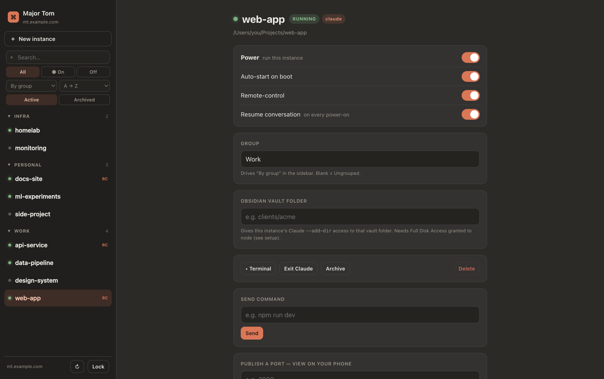
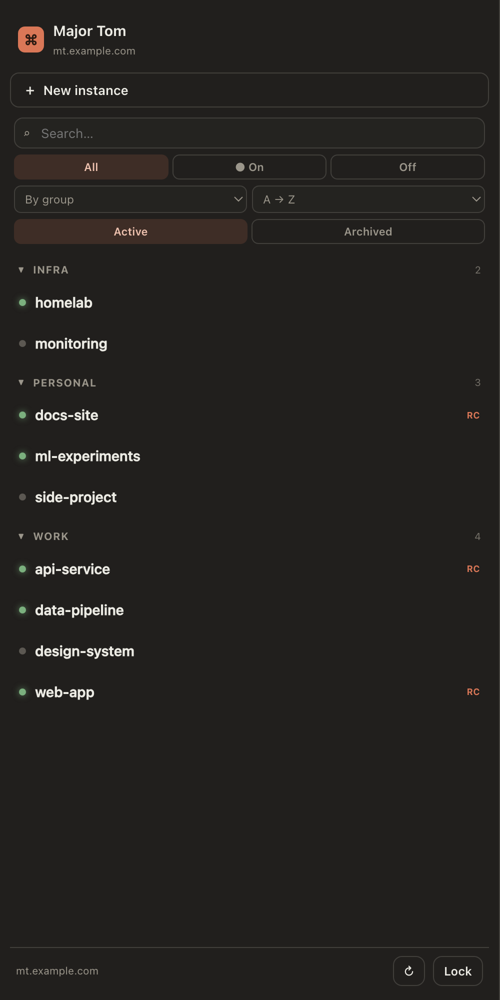
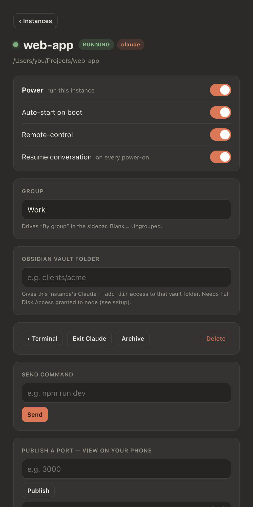

# Major Tom

**Run and control Claude Code sessions from your phone.**

Major Tom gives every project one persistent `tmux` session on your dev machine, then
puts a web panel in front of them. Open it on your phone over Tailscale to start a
project, resume its Claude Code conversation, hand control to the Claude mobile app,
drop into a real terminal, or expose a dev server's port — without touching your laptop.

Zero npm dependencies. The backend is one Node file using only built-ins; the UI is one
HTML file.

<p align="center">
  
</p>

<p align="center">
  
  &nbsp;
  
</p>

---

## Why

Long-running agent sessions don't fit the laptop-lid workflow. You start Claude Code on
something slow, close your laptop, and the session is gone. Terminal multiplexers solve
persistence but give you nothing to drive them from a phone.

Major Tom is the thin layer between: `tmux` keeps sessions alive, Tailscale makes them
reachable, and the panel makes them operable from a 6-inch screen.

## What it does

| | |
|---|---|
| **Instances** | One named tmux session per project folder. Start, stop, archive, group, search. |
| **Claude lifecycle** | Launch Claude Code in a session, optionally with `--continue` to resume the previous conversation. Per-instance toggle, honoured on every power-on. |
| **Remote control** | Flip a switch to run `/remote-control` in a session, so you can drive it from the Claude mobile app or claude.ai. |
| **Browser terminal** | Full interactive terminal per session via `ttyd`, reverse-proxied through the panel so it inherits the same auth. |
| **Publish ports** | Expose `localhost:3000` on your tailnet and get a URL you can open on your phone. |
| **Scheduled commands** | Attach saved commands to instances and run them on a schedule, live in the session or headless via `claude -p`. |
| **Boot recovery** | Instances flagged auto-start come back after a reboot, relaunch Claude, and reconnect remote control. |
| **Multi-host** | Run each instance on whichever machine suits it — this one, or any host in `hosts.json` reached over SSH. Browser terminals tunnel back over SSH so `ttyd` never listens on a remote LAN address. |

## Requirements

- **macOS** (see *Portability* below) with Node.js 18+
- `tmux`
- [Tailscale](https://tailscale.com) — the panel binds your tailnet IP, so it is never
  exposed to the public internet
- `ttyd` *(optional)* — only needed for the in-browser terminal
- [Claude Code](https://claude.com/claude-code) *(optional)* — only needed for the Claude features

## Quickstart

```bash
git clone https://github.com/mbelsawy/major-tom-open.git
cd major-tom-open
node server.mjs
```

It prints the URL it bound to. Open it, set a password on first visit, and add your first
instance.

To keep it running across reboots on macOS, install a launch agent:

```bash
cat > ~/Library/LaunchAgents/com.you.major-tom.plist <<'PLIST'
<?xml version="1.0" encoding="UTF-8"?>
<!DOCTYPE plist PUBLIC "-//Apple//DTD PLIST 1.0//EN" "http://www.apple.com/DTDs/PropertyList-1.0.dtd">
<plist version="1.0"><dict>
  <key>Label</key><string>com.you.major-tom</string>
  <key>ProgramArguments</key>
  <array><string>/usr/local/bin/node</string><string>/ABSOLUTE/PATH/TO/server.mjs</string></array>
  <key>WorkingDirectory</key><string>/ABSOLUTE/PATH/TO/major-tom-open</string>
  <key>RunAtLoad</key><true/>
  <key>KeepAlive</key><true/>
  <key>StandardOutPath</key><string>/ABSOLUTE/PATH/TO/server.log</string>
  <key>StandardErrorPath</key><string>/ABSOLUTE/PATH/TO/server.err.log</string>
</dict></plist>
PLIST
launchctl load ~/Library/LaunchAgents/com.you.major-tom.plist
```

### Configuration

All optional — every value has a working default.

| Variable | Default | Purpose |
|---|---|---|
| `CC_PORT` | `8787` | Port to listen on |
| `CC_BIND` | *waits for your Tailscale IP* | Bind address. Set explicitly to override; leaving it unset is what keeps the panel tailnet-only. |
| `PROJECTS_ROOT` | `~/Projects` | Root that instance folders must live under |
| `VAULT_BASE` | *(unset)* | Optional notes vault; folders under it can be passed to Claude via `--add-dir` |

State lives beside the server: `instances.json`, `commands.json`, and `auth.json`. **None
of these belong in version control** — `auth.json` holds your password hash and the key
that signs login cookies. The included `.gitignore` already excludes them.

## Security model

Major Tom executes arbitrary shell commands by design — that is the entire point — so
treat it as equivalent to shell access on the host.

- It binds your **Tailscale IP**, not `0.0.0.0`. Tailnet addresses are in CGNAT space and
  are not routable from the public internet.
- Access is password-gated with a scrypt hash and a signed, HttpOnly cookie.
- Plain HTTP over the tailnet is fine — that traffic is already WireGuard-encrypted. Put
  it behind a reverse proxy if you want a certificate and a real hostname.

> **Do not expose this to the public internet.** There is no login rate limiting, and an
> authenticated caller can run commands as your user. If you need off-tailnet access, put
> an identity-aware proxy in front of it.

## How it works

```
Browser (phone/laptop, on your tailnet)
        │  HTTP + signed cookie
        ▼
server.mjs  (Node, built-ins only — http/net/crypto/child_process)
   ├─ static UI ....... public/index.html (single-file SPA)
   ├─ JSON API ........ /api/*
   ├─ tmux ............ one session per instance (create/send/capture/kill)
   ├─ ttyd ............ per-instance terminal on 127.0.0.1:770x, proxied via /term/<name>
   ├─ port publish .... TCP proxy  tailnet:port → 127.0.0.1:port
   ├─ headless exec ... `claude -p` for scheduled commands, logged
   └─ scheduler ....... per-minute tick
```

## Portability

This was built for macOS and currently hardcodes Homebrew/macOS paths for its external
binaries — `/opt/homebrew/bin/tmux`, `/opt/homebrew/bin/ttyd`, `/usr/local/bin/tailscale`.
On Linux, or on an Intel Mac, edit those constants at the top of `server.mjs`. Making them
auto-detected is an obvious first contribution.

## Contributing

Issues and pull requests are welcome. The whole backend is one readable file — start there.

## License

[MIT](./LICENSE)
